# Classification

1. [Logistic Regression Motivation](#logistic-regression-motivation)
2. [Sigmoid Function](#the-sigmoid-function)
3. [Odds Ratio](#odds-ratio)
4. [Gradient Descent with Logistic Regression](#gradient-descent-with-logistic-regression)
5. [Validating](#validating)
6. [ROC Curve](#roc-curve)

A classification problem is when we're trying to predict a discrete (categorical) outcome. We'll start with binary classification (i.e., yes/no questions).

Here are some example questions:

* Does a patient have cancer?
* Will a team win the next game?
* Will the customer buy my product?
* Will I get the loan?

In binary classification, we assign labels of 0 and 1 to our data.


## Logistic Regression Motivation
Let's start by looking at an example. We're going to be using some NFL data. The x axis is the number of touchdowns scored by team over a season and the y axis is whether they lost or won the game indicated by a value of 0 or 1 respectively.


So, how do we predict whether we have a win or a loss if we are given a score? Note that we are going to be predicting values between 0 and 1. Close to 0 means we're sure it's in class 0, close to 1 means we're sure it's in class 1, and closer to 0.5 means we don't know.

If we use linear regression, we will certainly do better than randomly guessing, but it doesn't accurately represent the data:


So clearly a line is not the best way to model this data. So we need to find a better curve.


## The Sigmoid Function
First, we will just pull a function out of the data science bag of tricks and show that it works reasonably well.

And, second, we are going to understand how we came up with that function and how it is related to binary outcomes and odds. But before that let's understand this a bit better.

This function will need to have a value of 0 for the loss scores and 1 for the win scores. To make sense it will need to be 0 for some score and all scores below it and be 1 for some other score and all scores above it. And it will need to smoothly increase from 0 to 1 in the intermediate range.

It will need to look something like this:


A function that has the above shape is:

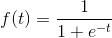

Note that as t approaches infinity, the value of the sigmoid function approaches 1 and as t approaches negative infinity, the value of the sigmoid function approaches 0.

We will use 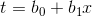, which means we'll be dealing with a familiar looking linear function.

This gives us:


h(x) is our hypothesis and it represents the probability of a score of x leading to a win. `b_0` and `b_1` are parameters that we will optimize to best fit our data.

Also note that this is just for the one variable case, but we can similarly plug in the linear equation for any size feature matrix.

This is not necessarily the "best possible" function, but there's two main reasons we use the sigmoid function:

1. It has the correct shape
2. It makes the math easy

We'll see another motivator for the sigmoid function with our investigation of the odds ratio!

## Odds Ratio

The *odds ratio* measures the odds of being in the positive class compared to the odds of being in the negative class. It's computed like this:

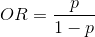

Vice versa, we can calculate the probability based on the odds ratio:

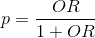

Odds are comonly used in gambling, especially horse racing. Here's some examples to get a sense of the value:

|           | odds |    odds ratio |       probability p |
| --------- | ---: | ------------: | ------------------: |
| Even odds |  1:1 |     `1/1 = 1` |     `1/(1+1) = 0.5` |
| Good odds |  3:1 |     `3/1 = 3` |    `1/(3+1) = 0.75` |
| Long shot | 1:20 | `1/20 = 0.05` | `1/(1+20) = 0.0476` |

We can rearrange the equation for *p* a bit (divide numerator and denominator by *OR*).

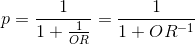

Let's actually look at the log of the odds ratio (this will make sense in a second). The *log odds ratio* is as follows:

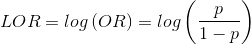

Now we can look at what *p* is in terms of the *log odds ratio*.

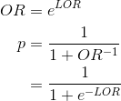

If we compare this to our sigmoid function from above, we see that *t = LOR*!

#### Interpreting the Beta coefficients

While it's not as simple in logistic regression to interpret the coefficients as it is in linear regression, we can use the odds ratio to do a nice interpration.

As we noted above, the following are true:

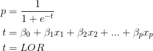

Let's look at how increasing *x_i* by 1 changes the log odds ratio. (This is the same as our interpretation in Linear Regression).

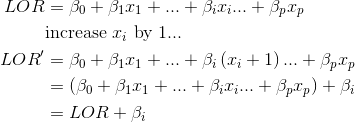

Now let's look at how it affects the Odds Ratio.

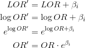

So now we can say the following:

***Increasing the value of x_i by 1 increases the odds ratio by a factor of e^b_i***


## Gradient Descent with Logistic Regression
Just like we did in linear regression, we will be using gradient descent to find the optimal coefficients. Recall that the gradient descent algorithm requires us to choose a cost function and calculate the gradient of the cost function.

#### Cost function
We would first like to calculate the probability that a given data point is predicted correctly.

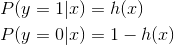

We can rewrite this as follows. Take a moment to convince yourself that this is equivalent. Try plugging in both 1 and 0 for y and look at the equation. Note that y is the true value so cannot take on any other values besides 0 and 1.

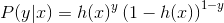

We are going to calculate the *likelihood* that we predict all the datapoints correctly. This is calculated by taking the product of all the individual likelihoods for each data point in our training set.

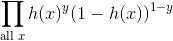

This is essentially our cost function. However, for computational reasons, we will be maximizing the log of this function instead. Maximizing the *log likelihood* is equivalent, but will make computations easier. One issue with calculating small probabilities with a computer it *numerical underflow*. Once the values get sufficiently small, they will be rounded to 0 and we will lose all information.

Using properties of log, we can simplify the formula:

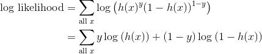


#### Gradient of the cost function
Recall that to use gradient descent, we need to know the gradient of the cost function. This is where we see the advantages of the sigmoid function. First, let's just calculate the derivative of the sigmoid:

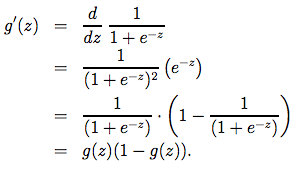

Isn't it nice how that works out?

So we'll take the partial of the cost function for each coefficient:

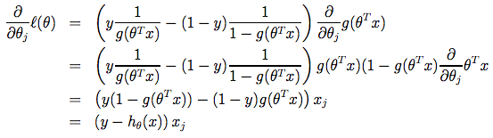

This is what we'll use to update the coefficients in each iteration of gradient descent.


## Validating

So how do we measure how well our model does? Just like with regression, we need to split the data in a training set and a test set and measure our success based on how well it does on the test set.

#### Accuracy
The simplest measure is **accuracy**. This is the number of correct predictions over the total number of predictions. It's the percent you predicted correctly. In `sklearn`, this is what the `score` method calculates.

#### Shortcomings of Accuracy
Accuracy is often a good first glance measure, but it has many shortcomings. If the classes are unbalanced, accuracy will not measure how well you did at predicting. Say you are trying to predict whether or not an email is spam. Only 2% of emails are in fact spam emails. You could get 98% accuracy by always predicting not spam. This is a great accuracy but a horrible model!

#### Confusion Matrix
We can get a better picture our model but looking at the confusion matrix. We get the following four metrics:

* **True Positives (TP)**: Correct positive predictions
* **False Positives (FP)**: Incorrect positive predictions (false alarm)
* **True Negatives (TN)**: Correct negative predictions
* **False Negatives (FN)**: Incorrect negative predictions (a miss)

|            | Predicted Yes  | Predicted No   |
| ---------- | -------------- | -------------- |
| Actual Yes | True positive  | False negative |
| Actual No  | False positive | True negative  |

With logistic regression, we can visulize it as follows:

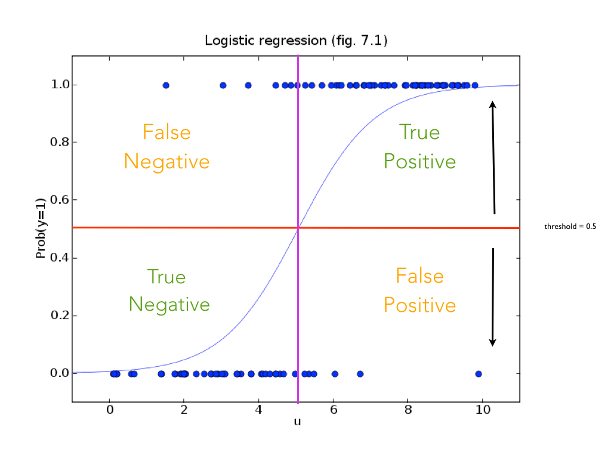

#### Precision, Recall and F1
Instead of accuracy, there are some other scores we can calculate:

* **Precision**: A measure of how good your positive predictions are

    ```
    Precison = TP / (TP + FP)
             = TP / (predicted yes)
    ```
* **Recall**: A measure of how well you predict positive cases. Aka *sensitivity*.

    ```
    Recall = TP / (TP + FN) 
           = TP / (actual yes)
    ```
* **F1 Score**: The harmonic mean of Precision and Recall

    ```
    F1 = 2 / (1 / Precision + 1 / Recall)
       = 2 * Precision * Recall / (Precision + Recall)
       = 2TP / (2TP + FN + FP)
    ```

* Accuracy can also be written in this notation:

    ```
    Accuracy = (TP + TN) / (TP + FP + TN + FN)
    ```

The [Wikipedia page for Confusion Matrix](https://en.wikipedia.org/wiki/Confusion_matrix) is excellent and defines all of these terms nicely.

## ROC Curve

Using the confusion matrix and all the values that we can calculate with it doesn't quite get at everything. With logistic regression, we are actually predicting probabilities, not just which class we think it belongs to. In the standard Logistic Regression, we put anything that has a probability of at least 0.5 in the positive class and everything else in the negative class. We could however choose any threshold from 0 to 1.

Each threshold corresponds to a different confusion matrix.

* Increasing the threshold will:
    - :grinning: decrease the number of False Positives,
    - :weary: decrease the number of True Positives,
    - :weary: increase the number of False Negatives, and
    - :grinning: increase the number of True Negatives.

Now we have an infinite number of models to compare! How are we going to investigate them?

We use the *Receiver Operating Characteristic* Curve, more commonly called the ***ROC Curve***.

We calculate the *False Positive Rate* and the *True Positive Rate* for every posible threshold and graph them all!

Here's how we calculate the FPR and TPR:

```
       # true positives     # correctly predicted positive
TPR = ------------------ = --------------------------------
       # positive cases           # positive cases

       # false positives     # incorrectly predicted positive
FPR = ------------------- = ----------------------------------
        # negative cases           # negative cases
```

Here's what the ROC Curve looks like:


Note that our ideal is the upper left corner, where our FPR is 0 and our TPR is 1.

While this graph shows us what FPR and TPR we can get, it does not tell us the theshold that yeilds a specific FPR and TPR. However, once we figure out what point on the graph we want, we can figure out the appropriate threshold (it's just not shown to us on the ROC curve).

Here is an example [ROC Animation](http://f.hypotheses.org/wp-content/blogs.dir/253/files/2013/09/roc-anim-glm.gif).

Here is the pseudocode for computing the ROC curve:

```
function ROC_curve(probabilities, labels):
    Sort instances by their prediction strength (the probabilities)
    For every instance in increasing order of probability:
        Set the threshold to be the probability
        Set everything above the threshold to the positive class
        Calculate the True Positive Rate (aka sensitivity or recall)
        Calculate the False Positive Rate (1 - specificity)
```

