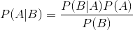
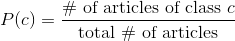
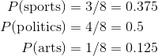
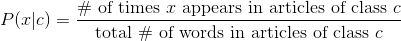
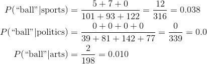
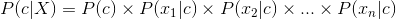
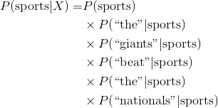
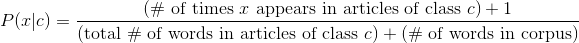
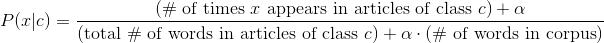
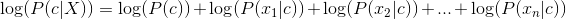

# Naive Bayes
Naive Bayes is a classifier that's built on Bayes Rule.

Recall *Bayes Rule*:

## Text Classification
Naive Bayes is often used in cases when we have a lot of features. Text classification is a good application of Naive Bayes since we have a feature for every word in our corpus.

In this problem, we have the text of articles and their topics (e.g. sports, politics, arts, etc.) and would like to classify the article to its appropriate class.

## Naive Bayes Intuition
We are going to be calculating the "probability" that an article belongs to each class. It's important to note that this will not be a true probability, but it will enable us to rank the classes to figure out which is the most likely.

Here's Bayes Rule applied to our scenario. *x* here is a word, *c* is the class (article topic). *X* is the document text of a specific document. The *xi*'s are all the words in the given document.

### Naivite of Naive Bayes
We make a BIG assumption here that the occurrences of each word are *independent*. If they weren't, we wouldn't be able to just multiply all the individual word probabilities together to get the whole document probability. Hence the "Naive" in *Naive Bayes*.

Take a moment to think of how absurd this is. A document that contains the word "soccer" is probably more likely to contain the word "ball" than an average document. We assume that this is not true! But it turns out that this assumption doesn't hurt us too much and we still have a lot of predictive power. But the probabilities that we end up with are not at all true probabilities. We can only use them to compare which of the classes is the most likely.

## The Algorithm
For every document, we calculate the probability that the document belongs to each class and chose the class with the highest probability.

To do this, we need to calculate two things:
* **Priors:** The probability that a generic document belongs to each class: *P(c)*
* **Conditional Probabilities:** The probability that each word appears in each class: *P(x|c)*

So how do we actually get all those probabilities? *It's just counting!* We count occurrences in our training set to get approximations of the probabilities.

### Priors
The priors are the likelihood of each class. Based on the distribution of classes in our training set, we can assign a probability to each class:

Take a very simple example where 3 classes: sports, news, arts. There are 3 sports articles, 4 politics articles and 1 arts articles. This is 8 articles total. Here are our priors:

### Conditional Probability Table
The first step is building the *Conditional Probability Table (CPT)*. We would like to get, for every word, the count of the number of times it appears in each class. We are calculating the probability that a random word chosen from an article of class *c* is word *x*.

Again, let's take our example. Let's look at the word "ball". Here are the occurrences in each of the 8 documents. We also need the word count of the documents.

| Article    | Occurrences of "ball" | Total # of words |
| :--------- | --------------------: | ---------------: |
| Sports 1   |                     5 |              101 |
| Sports 2   |                     7 |               93 |
| Sports 3   |                     0 |              122 |
| Politics 1 |                     0 |               39 |
| Politics 2 |                     0 |               81 |
| Politics 3 |                     0 |              142 |
| Politics 4 |                     0 |               77 |
| Arts 1     |                     2 |              198 |

Here are the values in the CPT table for the word "ball". We will do these calculations for all the words that appeared in the training documents.

### Maximum Likelihood Estimation
We need to pull this all together to use these calculations to make a prediction. Here, *X* is the content of an article and *x1, x2, x3, ...* are the words that make up the article.

We assign the article that has the largest probability. Note that since we made our incredibly naive assumption, these "probabilities" will not add to 1.

In our example, if we had the very short article of `The Giants beat the Nationals`, we would do the following calculations:

The first probability is the prior, and the remaining come from the Conditional Probability Table. We make the same calculation for each of the 3 classes and choose the class with the biggest probability.

### Zero Probabilities
If a word has never before appeared in a document of a certain class, the probability will be 0. Since we are multiplying the probability, the whole probability becomes 0! We basically lose all information.

In the above example, since "ball" never appears in a politics article in the training set, if it appeared in a new article, we would say that there was a 0% chance that that was a politics article. But that's too harsh!

How can we fix this?

The simplest option is to replace these zeros with a really small value, like 0.00000001.
The better option is *Laplace Smoothing*.

#### Laplace Smoothing
Laplace Smoothing is assuming that every word has been seen by every article class one extra time. One way of thinking of it is that we add a new document to every class which has every word in it exactly once. This will guarantee that no value will be 0. So we modify our calculations of the probabilities slightly.

Here's our new conditional probability with Laplace smoothing.

The standard is to use 1 as the smoothing constant, but in theory we could assume every word appeared half a time or something like this. This gives us a *smoothing constant*, which is a parameter we can tune:

### Log Likelihood
These probability values are going to get *really small*. Theoretically, this is not an issue, but when a computer makes the computation, we run the risk of *numerical underflow*. To keep our values bigger, we take the log. Recall that this is true: `log(ab) = log(a) + log(b)`

So when we calculated the MLE, we actually calculate the *log maximum likelihood error*.

Recall that if `a > b` `log(a) > log(b)` so we can still find the maximum of the log likelihoods.

### Summary of Naive Bayes Algorithm
* **Training**: Calculate the priors and Conditional Probability Table
* **Predict**: Calculate the MLE for the new article for each label and pick the max
