# Recommender Systems

Recommenders have been popularized by Netflix's [$1,000,000 prize](http://www.netflixprize.com/). We've all experienced recommenders. When you go onto Netflix, Amazon or basically any other site where you can buy things, you will see a list of personalized recommendations.

How do they come up with recommendations? One way is a *content based recommender*. This uses the description of the item and user preferences to make recommendations.

Today we will be talking about *collaborative filtering*. The recommendations are based on your and other users' buying and viewing history. In simple terms, you find items that are similar to items you've liked. Items are dubbed similar if the same people like both of them.

1. [Utility Matrix](#utility-matrix)
2. [Item-Item Similarity](#item-item-similarity)
3. [Predictions](#predictions)
4. [Validating a Recommender](#validating-a-recommender)
5. [Issues Facing Recommenders](#issues-facing-recommenders)
6. [Matrix Factorization](#matrix-factorization)


## Utility Matrix
Our feature matrix will consist of every user's rating of every item. Note that this is going to be a very sparse feature matrix. A lot of these values are unknown since most users have only rated a small percentage of the items.

It'll look something like this. The ratings are from 1 to 5 and 0 means the user has not rated the given item.

|            | item 1 | item 2 | item 3 | ... |
| :--------- | -----: | -----: | -----: | --- |
| **user 1** |      4 |      0 |      2 | ... |
| **user 2** |      0 |      5 |      0 | ... |
| **user 3** |      4 |      3 |      2 | ... |
| **...**    |    ... |    ... |    ... | ... |


## Item-Item Similarity
We will be focusing on *item-item recommenders*. You can also compute similarity between two users in the same way.

A big reason to use item-item recommenders over user-user recommenders is the amount of computation. It's often the case that we have a limited number of items (say 10,000) and *a lot* of users (say 100,000). In this example, if we do item-item similarity, we have 10,000 * 10,000 = 100,000,000 computations. If we do user-user similarity, we have 100,000 * 100,000 = 10,000,000,000 computations!


## Computing Similarity
There are a few metrics used to determine the similarity of two items. Each similarity metric will range from 0 to 1, where 1 means identitcal and 0 means completely different.

We've seen *euclidean distance* and *cosine similarity* in the context of [NLP](../../../Lectures/Week_6_NLP/1-Knowledge/Week_6_Knowledge.pdf) and [clustering](../../../Lectures/Week_7_Clustering/1-Knowledge/Week_7_Knowledge.pdf).

#### Euclidean Distance
Euclidean distance is the most intuitive of the distance metrics.

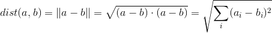

A euclidean distance of 0 means the items are identical, and the euclidean distance is unbounded. So to get the values in the range of 0 to 1, we calculate the similarity as follows:

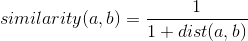

#### Pearson Correlation
The Pearson Correlation tells us how similar to vectors are. Note that it measures how far the values are from the mean.

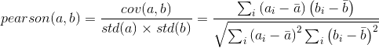

This is also the normalized covariance (in numpy, you can get it with [corrcoeff](http://docs.scipy.org/doc/numpy/reference/generated/numpy.corrcoef.html#numpy.corrcoef)).

Again, we would like our similarity to range from 0 to 1 (1 being completely similar). The Pearson Correlation ranges from -1 to 1, so we do the following normalization.

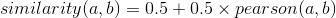

One advantage of the pearson correlation is that if you're measuring the similarity of two users, it isn't sensitive to a user who consistently rates low or high. Say user 1 rates three items: 5, 5, 3 and user 2 rates three items: 3, 3, 1. The similarity of these two users will be 1 (totally similar).


#### Cosine Similarity
The cosine similarity is a measure of the angle between two vectors. It's computed as follows.

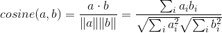

Again, we want to scale this so that the range is from 0 to 1. The cosine ranges from -1 (disimilar) to 1 (similar). So we can scale as follows.

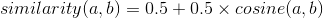


#### Jaccard Similarity
The Jaccard Similarity is a measure of the similarity of two sets. In this case, we would like to measure if two items have been rated by the same users. The Jaccard Similarity is useful when we don't have ratings, just a boolean value. For example, whether or not the user watched the movie, bought the product, etc.

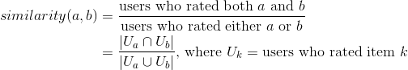

Note that this similarity metric already ranges from 0 (disimilar) to 1 (similar).


## Similarity Matrix
Using one of the similarity metrics, we compute a *similarity matrix*. If we have *m* items, this is an *m* by *m* matrix containing values from 0 to 1 giving the similarity of each item to each other item. Note that it will be symmetrical, since the similarity of item *x* to item *y* is the same as the similarity of item *y* to item *x*.

|            | item 1 | item 2 | item 3 | ... |
| :--------- | -----: | -----: | -----: | --- |
| **item 1** |      1 |    0.3 |    0.2 | ... |
| **item 2** |    0.3 |      1 |    0.7 | ... |
| **item 3** |    0.2 |    0.7 |      1 | ... |
| **...**    |    ... |    ... |    ... | ... |


## Predictions
Remember our goal was to give recommendations to users of movies they should watch (or products they should buy). So how do we get this from our similarity matrix?

Say user *u* hasn't rated item *i*. We would like to predict the rating that this user would give this item. We can think of this as a weighted average of the user's ratings of other items. Items that are more similar will get a higher weighting than items that are less similar.

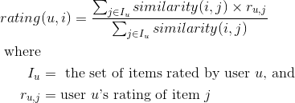

We calculate these predicted ratings for all the items that the user has not rated and order them by the predicted ratings. This is the order in which we would recommend items.


## Neighborhoods

This calculation of predicted ratings can be very costly. To mitigate this issue, we often use the concept of *neighborhoods*. We will only consider the *n* most similar items to an item when calculating the prediction.

Note that for each individual rating we are trying to predict we need to do a dot product of two vectors whose lengths are the number of items. We shrink the sizes of these vectors to speed up this dot product calculation.

Note that sometimes we will be unable to compute predicted ratings if a user hasn't rated any of the top *n* items.

<!---
\begin{align*}
rating(u, i)
 &= \frac{\sum_{j \in I_u \cap N_i} similarity(i, j) \cdot r_{u, j}}{\sum_{j \in I_u \cap N_i} similarity(i, j)} \\
\text{where } \\
N_i &\text{ is the } n \text{ items which are most similar to item } i
\end{align*}
-->
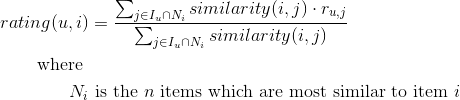


## Validating a Recommender
Recommenders are inherently hard to validate. In practice, we would launch the recommender with an A/B test and see if it leads to more conversions.

Beyond that, there isn't standard of how to evaluate a recommender. We do a kfold cross validation like we do with classification and regression. There's a couple different metrics we can use.

In general, our metrics are all biased, since our test set only has values for items the user has rated.

#### Root Mean Squared Error (RMSE)

Predict the rating for all user, movie pairs in the test set. Calculate the RMSE between your predicted values and the true values.

One concern with this metric is that it considers how far off you are with all of your ratings. For our use case, however, we really only care about the top items. So we have a couple other metrics that just consider this.
s
#### Precision at n

Take your predicted top n ratings. We calculate the percent of these which are relevant. Here we define relevant as it's been watched.

#### Recall at n

Take your predicted top n ratings. We calculate the percent of the relevant items are in the top 10.

## Issues Facing Recommenders
#### The Cold Start Problem
A collaborative filter doesn't work if you haven't rated any items yet. To get around this, a lot of recommenders will force users to rate some items to get started. If you've ever used Netflix, you'll notice that when you start it asks you to rate a few movies before it gives you any recommendations. This is to overcome the *cold start problem*.

#### Data sparsity
It's very common for most users to only have rated a very small percentage of the items. This makes it difficult for the collaborative filter to work since many pairs of items won't have a lot of users who rated both of them.

We can deal with this by using matrix factorization and other dimensionality reduction techniques.


## Matrix Factorization
The idea behind this comes from the dimensionality techniques we've seed like SVD and NMF. Basically we factor the matrix into two matrices and when we multiply them back together we fill in the holes.

To find the matrix factorization, we will have an iterative algorithm which adjusts the values of the matrices to make the product of the two matrices as close as possible to the original.

#### Root Mean Squared Error
To evaluate how well the factorization represents the original data, we use RMSE. This is the same concept we've defined before, but we need to recognize that we don't know the true values for all of the entries in the matrix. So we only calculate the RMSE for the entries that we have a rating value for.

<!---
\begin{align*}
\text{RMSE} &= \sqrt{\sum_{\substack{\text{user } u \text{ rated} \\ \text{item } i}}
                        \left( r_{u,i} - p_{u,i} \right)^2
                   } \\
\text{where} \\
r_{u,i} &\text{ is the true rating that user } u \text{ gave item } i \\
p_{u,i} &\text{ is the predicted rating for user } u \text{ of item } i
\end{align*}
-->
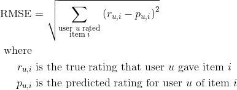

### UV Decomposition Algorithm

We generally use incremental computation of the UV Decomposition. We update one entry at a time.

```
Matrix Factorization Recommender(data, num_factors):
    Initialize a U matrix with dimensions num_users by num_factors
    Initialize a V matrix with dimensions num_factors by num_items

    repeat until RMSE doesn't improve:
        for each user x:
            for each item i that user x has rated:
                calculate error (difference between predicted rating and true rating)
                update row x of matrix U
                update column i of matrix V
```

To get the formulas for the updates, we take the partial derivative of the error formula, which is as follows:

<!---
\begin{align*}
e_{x,i} &= \left( r_{x,i} - p_{x,i} \right)^2 \\
\text{where} \\
r_{u,i} &\text{ is the true rating that user } u \text{ gave item } i \\
p_{u,i} &\text{ is the predicted rating for user } u \text{ of item } i
\end{align*}
-->
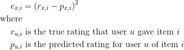

Note that the way we calculate the predicted ratings is by multiplying the *U* and *V* matricies together. So to get a single rating, it's the dot product of one row in *U* with one column in *V*.

<!---
p_{x,i} &= \sum_{k=1}^{\text{\# factors}} U_{x,k} V_{k,i}
-->
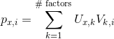

<!---
\begin{align*}
e_{x,i} &= \left( r_{x,i} - p_{x,i} \right)^2 \\
&= \left( r_{x,i} - \sum_{k=1}^{\text{\# factors}} U_{x,k} V_{k,i} \right)^2 \\
\end{align*}
-->
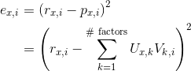

And here are the update formulas. You can find the calculations of the partial derivatives at the end of these notes. Note that we have a learning rate alpha.

<!---
\begin{align*}
U_{x,f} \text{ } &+= \alpha \cdot e_{x,i} \cdot V_{f,i} \\
V_{f,i} \text{ } &+= \alpha \cdot e_{x,i} \cdot U_{x,f} \\
\text{where} \\
f &\text{ is the factor number} \\
x &\text{ is the user number} \\
i &\text{ is the item number} \\
\alpha &\text{ is the learning rate} \\
e_{x,i} &\text{ is the error in the calculation of user } x \text{'s rating of item } i \\
U_{x,f} &\text{ is the appropriate entry in the } U \text{ matrix} \\
V_{f, i} &\text{ is the appropriate entry in the } V \text{ matrix}
\end{align*}
-->
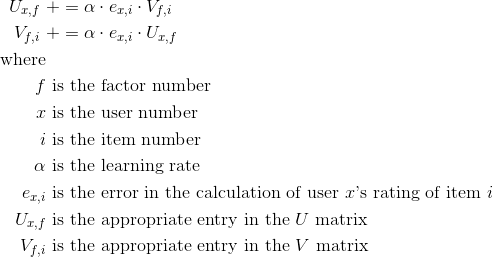

#### Regularization

We often want to use regularization to avoid overfitting. This is very analagous to the regularization we used with Linear and Logistic Regression (Lasso and Ridge).

Here are the update formulas. Note that we have a regularization parameter lambda.

<!---
\begin{align*}
U_{x,f} \text{ } &+= \alpha \left( e_{x,i} \cdot V_{f,i} + \lambda U_{x,f} \right)\\
V_{f,i} \text{ } &+= \alpha \left( e_{x,i} \cdot U_{x,f} + \lambda V_{f,i} \right)
\end{align*}
-->
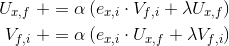

#### Calculation of Partial Derivatives of Error

Here are the calculations which show how we got the update formulas.

We start by recalling the formula for the error rate from above.


We take the partial derivative with respect to the entry in the *U* matrix.

<!---
\begin{align*}
\frac{\partial e_{x,i}}{\partial U_{x,f}}
&= 2 \left( r_{x,i} - p_{x,i} \right) \frac{\partial p_{x,i}}{\partial U_{x,f}} \\
&= 2 \left( r_{x,i} - p_{x,i} \right) \frac{\partial}{\partial U_{x,f}} \left( U_{x,f} \cdot V_{f,i} \right) \\
&= 2 \left( r_{x,i} - p_{x,i} \right) V_{k,i} \\
&= 2 e_{x,i} \cdot V_{k,i}
\end{align*}
-->
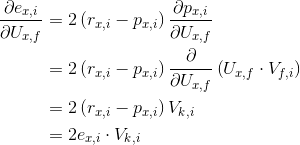

Now to get the other update formula, we can take the partial derivative with respect to the entry in the *V* matrix. This calculation is quite similar.

<!---
\begin{align*}
\frac{\partial e_{x,i}}{\partial V_{f,i}}
&= 2 \left( r_{x,i} - p_{x,i} \right) \frac{\partial p_{x,i}}{\partial V_{f,i}} \\
&= 2 \left( r_{x,i} - p_{x,i} \right) \frac{\partial}{\partial V_{f,i}} \left( U_{x,f} \cdot V_{f,i} \right) \\
&= 2 \left( r_{x,i} - p_{x,i} \right) U_{x,f} \\
&= 2 e_{x,i} \cdot U_{x,f}
\end{align*}
-->
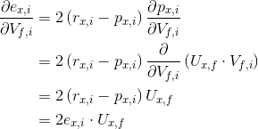
