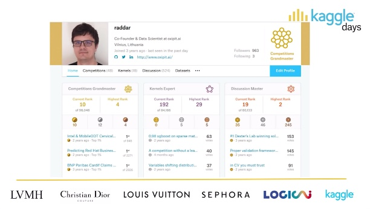
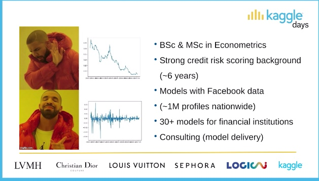
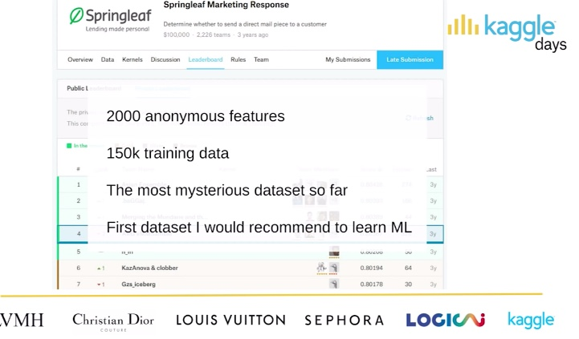
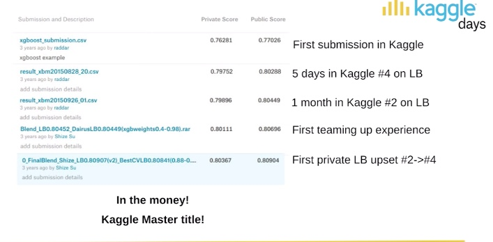
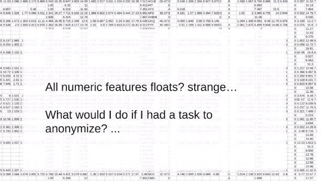
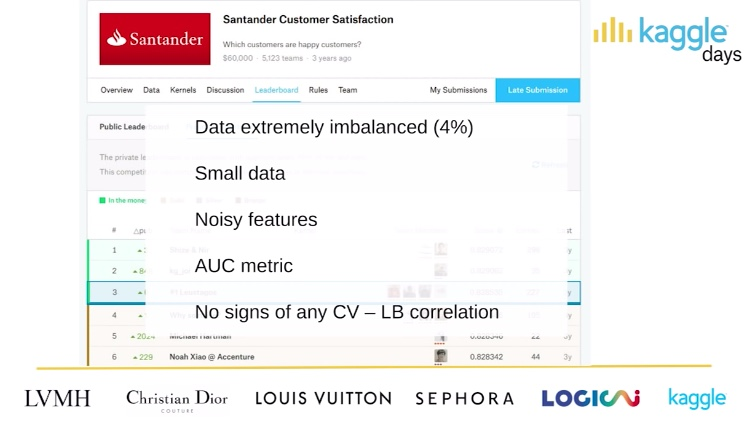
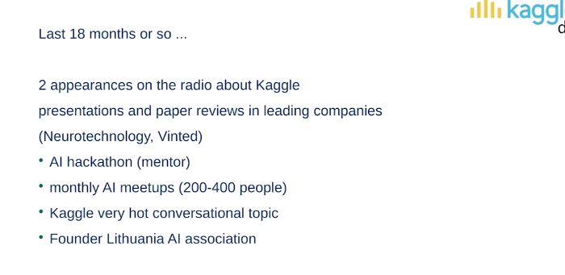

In this video, radder shared his experience in becoming a grandmaster in kaggle after 4 competitions. ALso shared some feature engineering techniques, talked about data leakages.

[Youtube](https://www.youtube.com/watch?v=7XEMPU17-Wo)
[radder's kaggle profile](https://www.kaggle.com/raddar)

2 months to Kaggle GrandMaster
==============================

BackGround
----------

The first dataset
-----------------

### Team up with top 10

People who inspire and instructed him.

There are a lot videos on YouTube of these two guys.

Find a way much simpler



Find problems : no integers.

Unscaling unmeaning, find timestamp, 

Sort by categotical features and find relationships; 

Find lead feature and remove nosisy features;

Brute force ? ???

Third competition
-----------------

Apply it while meeting samll dataset.

