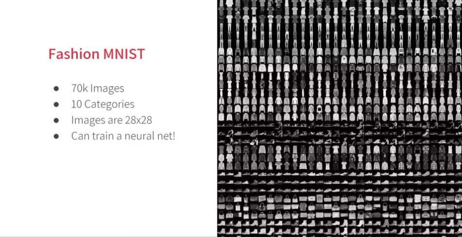
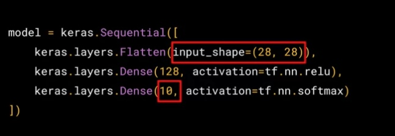

Week 1 Resources | Coursera
===========================

[Source](https://www.coursera.org/learn/introduction-tensorflow/supplement/6tZWF/week-1-resources "Permalink to Week 1 Resources | Coursera")

That brings you to the end of what you need to look at for Week 1\. If you’re eager to learn more, before we go to Week 2, there are some great resources you can check out:

* AI For Everyone is a non-technical course that will help you understand many of the AI technologies we will discuss later in this course, and help you spot opportunities in applying this technology to solve your problems. <https://www.deeplearning.ai/ai-for-everyone/>
* TensorFlow is available at [TensorFlow.org](https://tensorflow.org/), and video updates from the TensorFlow team are at [youtube.com/tensorflow](https://www.youtube.com/tensorflow)

Play with a neural network right in the browser at [http://playground.tensorflow.org](http://playground.tensorflow.org/). See if you can figure out the parameters to get the neural network to pattern match to the desired groups. The spiral is particularly challenging!

The 'Hello World' notebook that we used in this course is available on GitHub [here](https://github.com/lmoroney/dlaicourse/blob/master/Course%201%20-%20Part%202%20-%20Lesson%202%20-%20Notebook.ipynb).

Week 2 Intro to Computer Vision
===============================



[Fashion MNIST](https://github.com/zalandoresearch/fashion-mnist)



Now, we have a 3 layer NN, last layer has 10, because we have 10 classes.

[https://colab.research.google.com/github/lmoroney/dlaicourse/blob/master/Course%201%20-%20Part%204%20-%20Lesson%202%20-%20Notebook.ipynb\#scrollTo=BLMdl9aP8nQ0](https://colab.research.google.com/github/lmoroney/dlaicourse/blob/master/Course%201%20-%20Part%204%20-%20Lesson%202%20-%20Notebook.ipynb#scrollTo=BLMdl9aP8nQ0)

Exercise

Call back

```python
import tensorflow as tf

class myCallback(tf.keras.callbacks.Callback):
  def on_epoch_end(self, epoch, logs={}):
    if(logs.get('acc')>0.6):
      print("\nReached 60% accuracy so cancelling training!")
      self.model.stop_training = True

mnist = tf.keras.datasets.fashion_mnist

(x_train, y_train),(x_test, y_test) = mnist.load_data()
x_train, x_test = x_train / 255.0, x_test / 255.0

callbacks = myCallback()

model = tf.keras.models.Sequential([
  tf.keras.layers.Flatten(input_shape=(28, 28)),
  tf.keras.layers.Dense(512, activation=tf.nn.relu),
  tf.keras.layers.Dense(10, activation=tf.nn.softmax)
])
model.compile(optimizer='adam',
              loss='sparse_categorical_crossentropy',
              metrics=['accuracy'])

model.fit(x_train, y_train, epochs=10, callbacks=[callbacks])
```


Here are all the notebook files for this week, hosted on GitHub. You can download and play with them from there!

[Beyond Hello, World - A Computer Vision Example](https://github.com/lmoroney/dlaicourse/blob/master/Course%201%20-%20Part%204%20-%20Lesson%202%20-%20Notebook.ipynb)

[Exploring Callbacks](https://github.com/lmoroney/dlaicourse/blob/master/Course%201%20-%20Part%204%20-%20Lesson%204%20-%20Notebook.ipynb)

[Exercise 2 - Handwriting Recognition - Answer](https://github.com/lmoroney/dlaicourse/blob/master/Exercises/Exercise%202%20-%20Handwriting%20Recognition/Exercise2-Answer.ipynb)

Week 3 Enhancing Vision with Convolutional Neural Networks
==========================================================

The concepts introduced in this video are available as [Conv2D](https://www.tensorflow.org/api_docs/python/tf/keras/layers/Conv2D) layers and [MaxPooling2D](https://www.tensorflow.org/api_docs/python/tf/keras/layers/MaxPool2D) layers in TensorFlow. You’ll learn how to implement them in code in the next video…

You’ve seen how to add a convolutional 2d layer to the top of your neural network in the previous video. If you want to see more detail on how they worked, check out the playlist at <https://bit.ly/2UGa7uH>.

The convolution exercise colab notebook. <https://colab.research.google.com/github/lmoroney/dlaicourse/blob/master/Course%201%20-%20Part%206%20-%20Lesson%202%20-%20Notebook.ipynb>


Convolutions Sidebar: [here’s the notebook](https://colab.research.google.com/github/lmoroney/dlaicourse/blob/master/Course%201%20-%20Part%206%20-%20Lesson%203%20-%20Notebook.ipynb "notebook"). Get understood what is happening underwood Con2D in tersorflow, get understood how the convolutino works.

**Try different filters, and research different filter types. There's some fun information about them here: **<https://lodev.org/cgtutor/filtering.html>

Reading: We've put the notebooks that you used this week into GitHub so you can download and play with them.

[Adding Convolutions to Fashion MNIST](https://github.com/lmoroney/dlaicourse/blob/master/Course%201%20-%20Part%206%20-%20Lesson%202%20-%20Notebook.ipynb)

[Exploring how Convolutions and Pooling work](https://github.com/lmoroney/dlaicourse/blob/master/Course%201%20-%20Part%206%20-%20Lesson%203%20-%20Notebook.ipynb)

Week4 Using Real-world Images
=============================

As Andrew and Laurence discussed, the techniques you’ve learned already can apply to complex images, and you can start solving real scenarios with them. They discussed how it could be used, for example, in disease detection with the Cassava plant, and you can see a video demonstrating that [here](https://www.youtube.com/watch?v=NlpS-DhayQA). Once you’ve watched that, move onto the next lesson!

Now that you’ve learned how to download and process the horses and humans dataset, you’re ready to train. When you defined the model, you saw that you were using a new loss function called ‘[Binary Crossentropy](https://gombru.github.io/2018/05/23/cross_entropy_loss/)’, and a new [optimizer](https://www.tensorflow.org/api_docs/python/tf/train/RMSPropOptimizer) called [RMSProp](http://www.cs.toronto.edu/~tijmen/csc321/slides/lecture_slides_lec6.pdf). If you want to learn more about the type of binary classification we are doing here, check out [this](https://www.youtube.com/watch?v=eqEc66RFY0I&t=6s) great video from Andrew!

Now you can give it a try for yourself. [Here’s](https://colab.sandbox.google.com/github/lmoroney/dlaicourse/blob/master/Course%201%20-%20Part%208%20-%20Lesson%203%20-%20Notebook.ipynb) the notebook the Laurence went through in the video. Have a play with it to see how it trains, and test some images yourself! Once you’re done, move onto the next video where you’ll compact your data to see the impact on training.

[this](https://colab.sandbox.google.com/github/lmoroney/dlaicourse/blob/master/Course%201%20-%20Part%208%20-%20Lesson%204%20-%20Notebook.ipynb) version of the notebook where Laurence compacted the images. You can see that training times will improve, but that some classifications might be wrong! Experiment with different sizes -- you don’t have to use 150x150 for example!

You used a few notebooks this week. For your convenience, or offline use, I've shared them on GitHub. The links are below:

[Horses or Humans Convnet](https://github.com/lmoroney/dlaicourse/blob/master/Course%201%20-%20Part%208%20-%20Lesson%202%20-%20Notebook.ipynb)

[Horses or Humans with Validation](https://github.com/lmoroney/dlaicourse/blob/master/Course%201%20-%20Part%208%20-%20Lesson%203%20-%20Notebook.ipynb)

[Horses or Humans with Compacting of Images](https://github.com/lmoroney/dlaicourse/blob/master/Course%201%20-%20Part%208%20-%20Lesson%204%20-%20Notebook.ipynb)

Exercise 4 - Handling complex images
------------------------------------

This is the same exercise and notebook as provided [here](https://www.coursera.org/learn/introduction-tensorflow/notebook/PNLYD/exercise-4-handling-complex-images "Exercise 4 Jupyter notebook on Coursera"). This button below will take you to the Google Colaboratory environment, in case you would like to use it to follow along with the course videos. In order to pass the graded item, you will still need to submit your work via the Coursera-hosted Jupyter Notebook.

Congratulations! You've reached the end of course 1! You've come a long way from looking at the most basic of neural networks to building a basic computer vision neural network that classified clothing. You took this a little further by using Convolutions that spot features in an image, and then classify and learn based on those features.


