Week1 Sentiment in Text
=======================

* The first step in understanding sentiment in text, and in particular when training a neural network to do so is **the tokenization of that text**. 

* This is the **process** of converting the text into numeric values, with a number representing a word or a character. 

* This week you'll learn about the Tokenizer and pad\_sequences APIs in TensorFlow and how they can be used to prepare and encode text and sentences to get them ready for training neural networks!

### Word based encoding

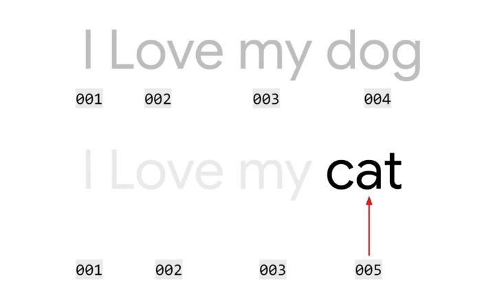

### Using APIs (Tensorflow and Keras)

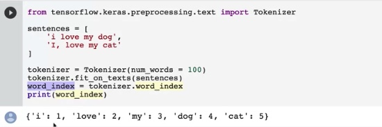

### Text to sequence and Padding

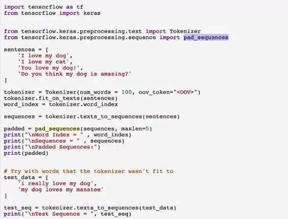

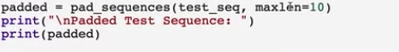

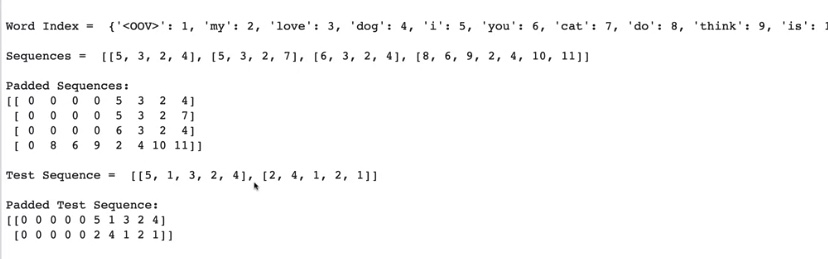

###  Sarcase in Kaggle

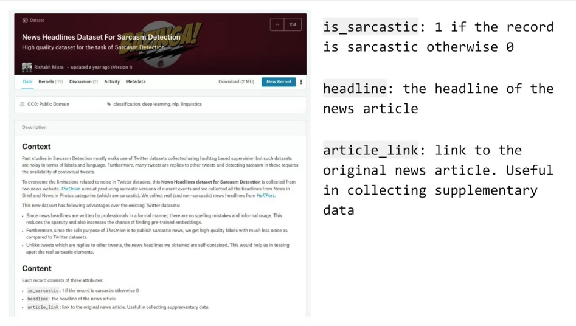

The following is the public domain dataset based on sarcasm, as depicted in the previous video.

The link is provided here for your convenience:

[Sarcasm in News Headlines Dataset by Rishabh Misra](https://rishabhmisra.github.io/publications/)

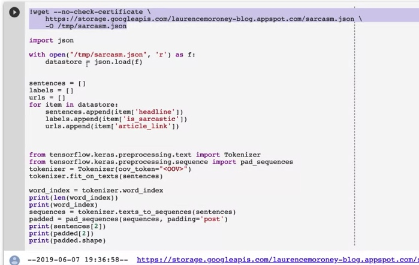

#### Week 1 Wrap up

This week, you looked at how to tokenize words, 

turning them into numbers, 

and using a dictionary to look 

up which word goes with which number. 

Next week, you'll take that to 

the next step using something called Embeddings, 

that takes these numbers and 

starts to establish sentiment from them, 

so that you can begin to classify 

and then later predict texts.

Exercise 1- Explore the BBC news archive
----------------------------------------

For this exercise you’ll get the [BBC text archive](http://mlg.ucd.ie/datasets/bbc.html "BBC text archive link"). Your job will be to tokenize the dataset, removing common stopwords. A great source of these stop words can be found [here](https://github.com/Yoast/YoastSEO.js/blob/develop/src/config/stopwords.js "Github repository").

Week2 Word Embeddings
=====================

Today in the world of applied NLP, 

word embeddings has proved to be one of 

the most powerful and useful ideas to 

help teams get good performance.

there's a library called 

TensorFlow Data Services or TFDS for short, 

and that contains many data sets 

and lots of different categories.

Please find the link to he IMDB reviews dataset [here](http://ai.stanford.edu/~amaas/data/sentiment/)

You will find here 50,000 movie reviews which are classified as positive of negative.

### IMDB data set

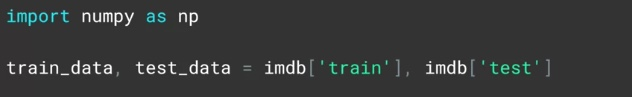

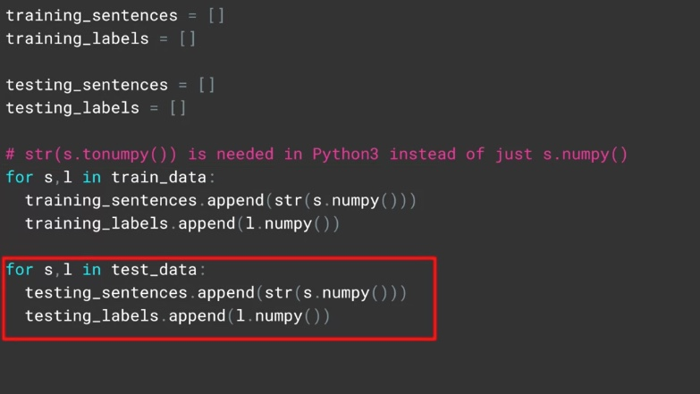

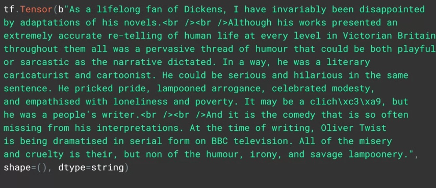

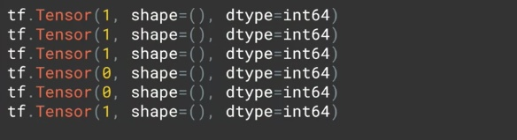

Putting the hyperparameters as 

separate variables like this is 

a useful programming exercise, 

making it much easier for you to 

tweak and explore their impact on training.

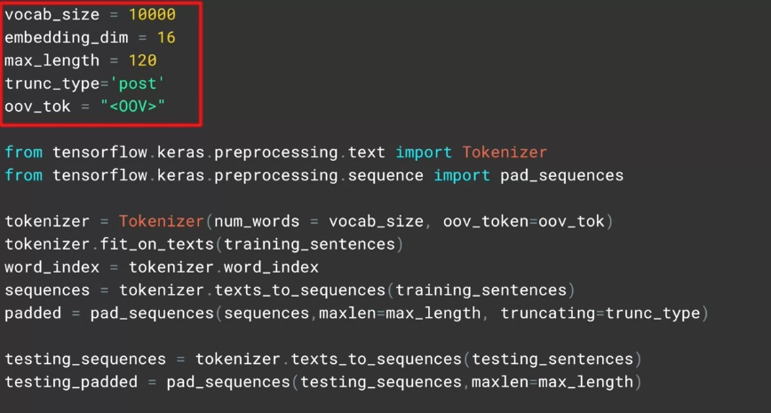

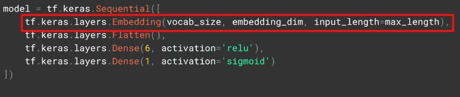

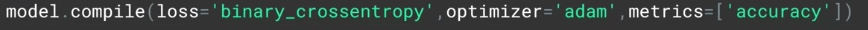

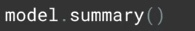

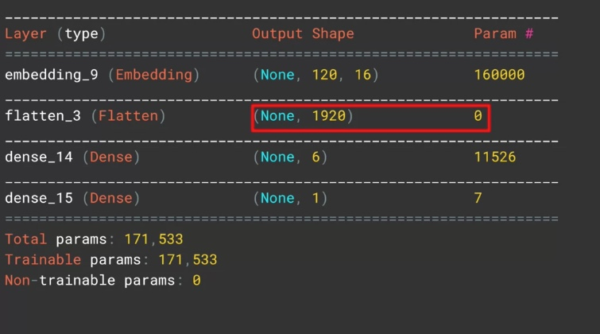

OR ( faster, but less accuracy)

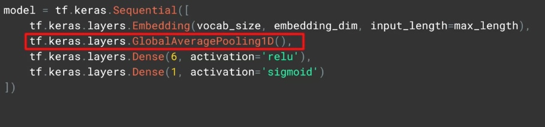

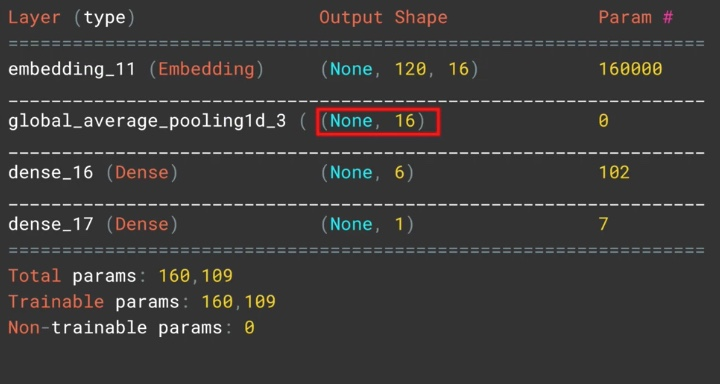

The link to the colab IMDB dataset classification

Here is the [link](https://colab.research.google.com/github/lmoroney/dlaicourse/blob/master/TensorFlow%20In%20Practice/Course%203%20-%20NLP/Course%203%20-%20Week%202%20-%20Lesson%201.ipynb)

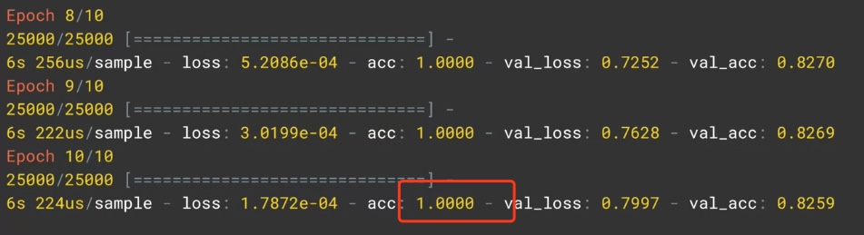

Overfitting

### Plot the result

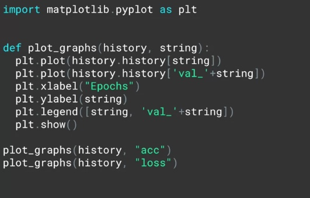

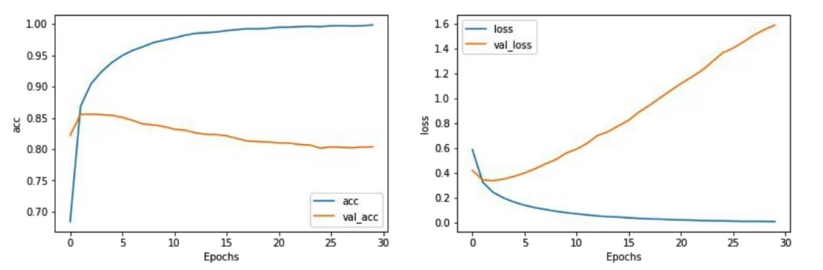

while the number of accurate predictions increased over time, what was interesting was that the confidence per prediction effectively decreased. You may find this happening a lot with text data. So it's very important to keep an eye on it. One way to do this is to explore the differences as you tweak the hyperparameters.
* a decrease in vocabulary size, and taking shorter sentences, reducing the likelihood of padding
* Another tweak. Changing the number of dimensions using the embedding was also tried

### GET the embedding laber and put into embedding projector

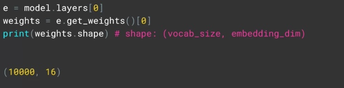

As it currently stands, 

our word index has the key being the word, 

and the value being the token for the word. 

We'll need to flip this around, 

to look through the padded list to 

decode the tokens back into the words

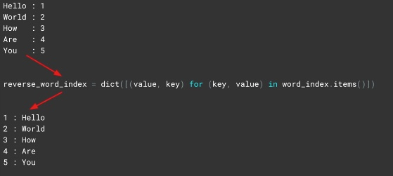

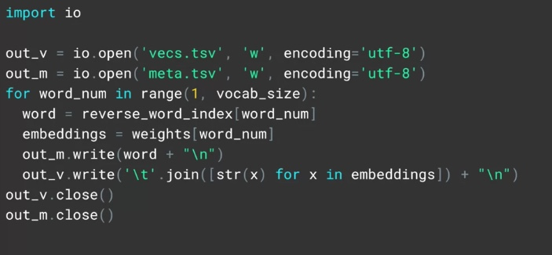

in colab

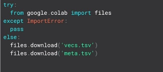

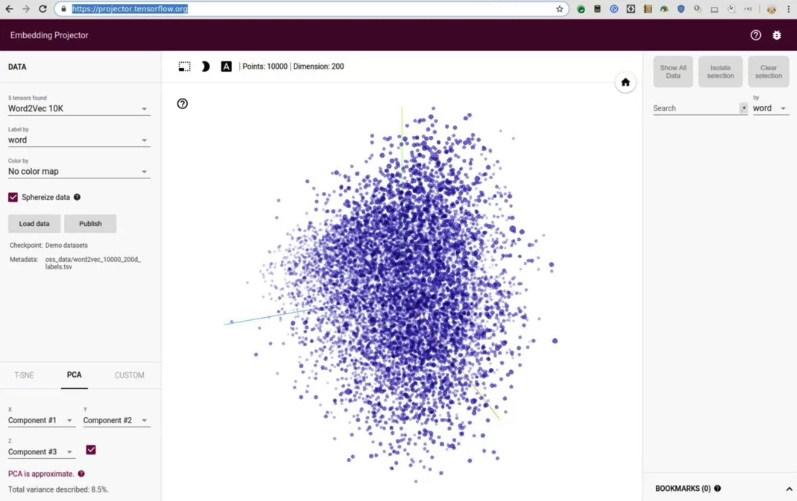

projector.tensorflow.org

**

text classification can have some unique issues, 

namely that the sequence of words can 

be just as important as their existence.

**

### Subwords text encoder

[https://www.tensorflow.org/datasets/api\_docs/python/tfds/features/text/SubwordTextEncoder](https://www.tensorflow.org/datasets/api_docs/python/tfds/features/text/SubwordTextEncoder)

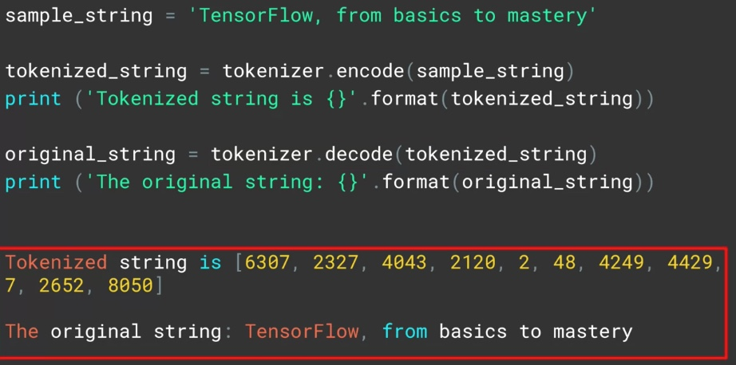

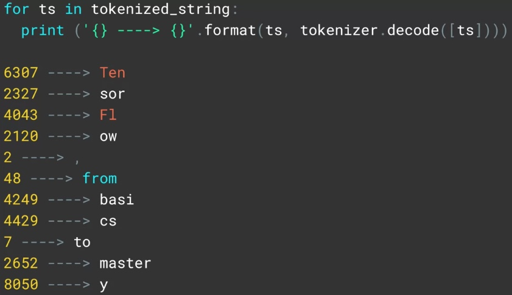

This week you looked at taking your tokenized words and using Embeddings to establish meaning from them in a mathematical way. Words were mapped to vectors in higher dimensional space, and the semantics of the words then learned when those words were labelled with similar meaning. So, for example, when looking at movie reviews, those movies with positive sentiment had the dimensionality of their words ending up ‘pointing’ a particular way, and those with negative sentiment pointing in a different direction. From this, the words in future sentences could have their ‘direction’ established, and from this the sentiment inferred. You then looked at sub word tokenization, and saw that not only do the meanings of the words matter, but also the sequence in which they are found.

Week3 Sequence models
=====================

sentiment can also be determined by the sequence in which words appear. For example, you could have 'not fun', which of course is the opposite of 'fun'.

Here is the [link](https://www.coursera.org/lecture/nlp-sequence-models/deep-rnns-ehs0S) to Andrew's course on sequence modeling.

Please find here a [link](https://www.coursera.org/lecture/nlp-sequence-models/long-short-term-memory-lstm-KXoay) to more information on LSTMs (Long Short Term Memory cells) by Andrew.

Implement RNN LSTM
------------------

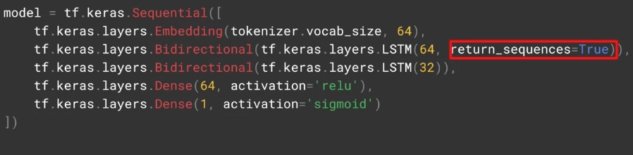

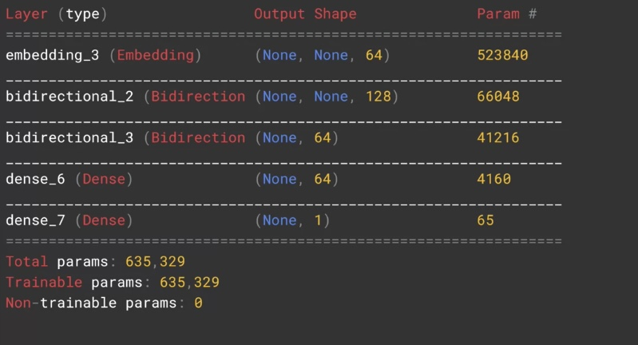

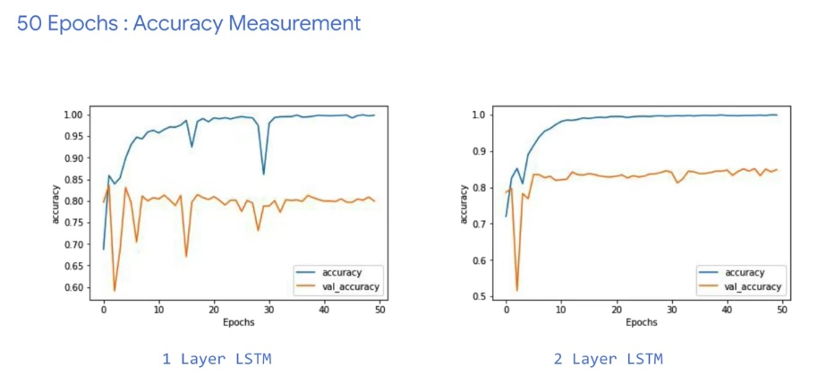

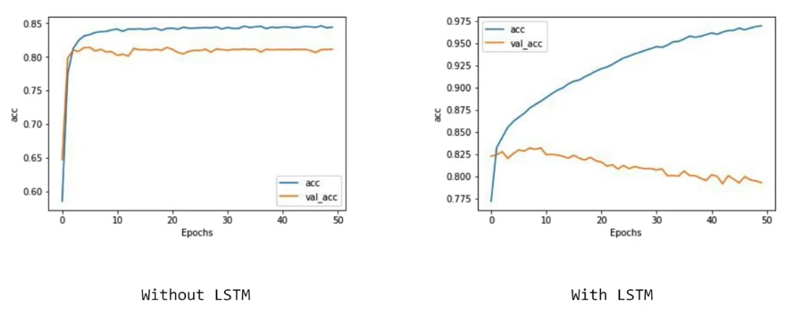

implent a convolution layer
---------------------------

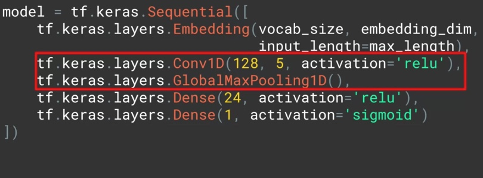

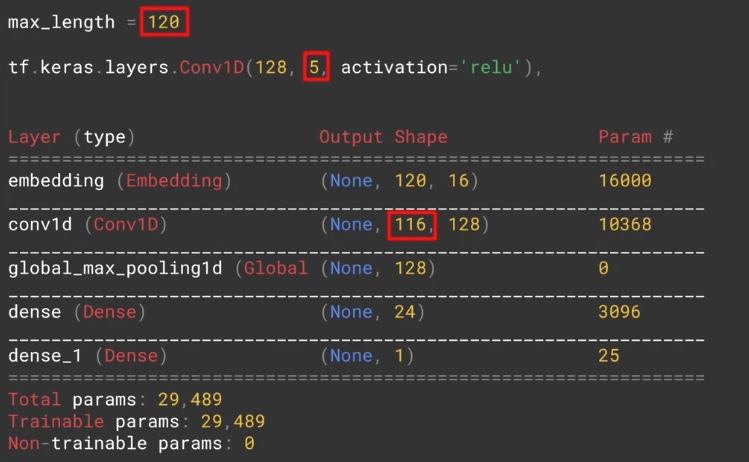

We've created a number of notebooks for you to explore the different types of sequence model.

Spend some time going through these to see how they work, and what the impact of different layer types are on training for classification.

[IMDB Subwords 8K with Single Layer LSTM](https://colab.research.google.com/github/lmoroney/dlaicourse/blob/master/TensorFlow%20In%20Practice/Course%203%20-%20NLP/Course%203%20-%20Week%203%20-%20Lesson%201a.ipynb)

[IMDB Subwords 8K with Multi Layer LSTM](https://colab.research.google.com/github/lmoroney/dlaicourse/blob/master/TensorFlow%20In%20Practice/Course%203%20-%20NLP/Course%203%20-%20Week%203%20-%20Lesson%201b.ipynb)

[IMDB Subwords 8K with 1D Convolutional Layer](https://colab.research.google.com/github/lmoroney/dlaicourse/blob/master/TensorFlow%20In%20Practice/Course%203%20-%20NLP/Course%203%20-%20Week%203%20-%20Lesson%201c.ipynb)

[Sarcasm with Bidirectional LSTM](https://colab.research.google.com/github/lmoroney/dlaicourse/blob/master/TensorFlow%20In%20Practice/Course%203%20-%20NLP/Course%203%20-%20Week%203%20-%20Lesson%202.ipynb#scrollTo=g9DC6dmLF8DC)

[Sarcasm with 1D Convolutional Layer](https://colab.research.google.com/github/lmoroney/dlaicourse/blob/master/TensorFlow%20In%20Practice/Course%203%20-%20NLP/Course%203%20-%20Week%203%20-%20Lesson%202c.ipynb#scrollTo=g9DC6dmLF8DC)

[IMDB Reviews with GRU (and optional LSTM and Conv1D)](https://colab.research.google.com/github/lmoroney/dlaicourse/blob/master/TensorFlow%20In%20Practice/Course%203%20-%20NLP/Course%203%20-%20Week%203%20-%20Lesson%202d.ipynb#scrollTo=nHGYuU4jPYaj)

Exercise 3- Exploring overfitting in NLP

When looking at a number of different types of layer for text classification this week you saw many examples of overfitting -- with one of the major reasons for the overfitting being that your training dataset was quite small, and with a small number of words. Embeddings derived from this may be over generalized also. So for this week’s exercise you’re going to train on a large dataset, as well as using transfer learning of an existing set of embeddings.
The dataset is from: <https://www.kaggle.com/kazanova/sentiment140>. I’ve cleaned it up a little, in particular to make the file encoding work with Python CSV reader.
The embeddings that you will transfer learn from are called the GloVe, also known as Global Vectors for Word Representation, available at: <https://nlp.stanford.edu/projects/glove/>

---

This course uses a third-party tool, Exercise 3- Exploring overfitting in NLP, to enhance your learning experience. No personal information will be shared with the tool. [click here](<https://colab.research.google.com/github/lmoroney/dlaicourse/blob/master/TensorFlow%20In%20Practice/Course%203%20-%20NLP/NLP%20Course%20-%20Week%203%20Exercise%20Answer.ipynb>)

Week 4 Sequence models and literature
=====================================

Taking everything that you've learned in training a neural network based on NLP, we thought it might be a bit of fun to turn the tables away from classification and use your knowledge for prediction. Given a body of words, you could conceivably predict the word most likely to follow a given word or phrase, and once you've done that, to do it again, and again. With that in mind, this week you'll build a poetry generator. It's trained with the lyrics from traditional Irish songs, and can be used to produce beautiful-sounding verse of it's own!

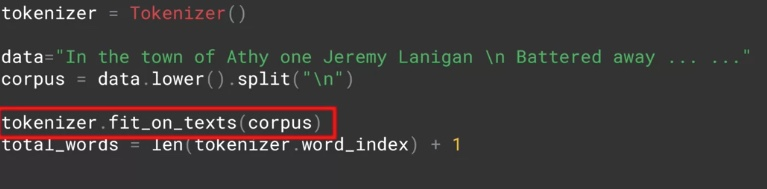

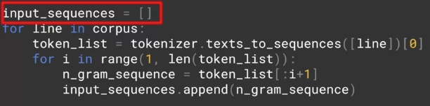

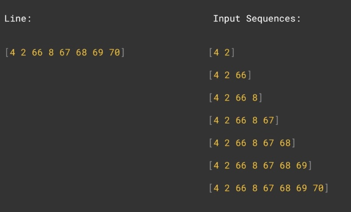

Find the max length of the sentence

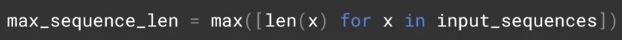

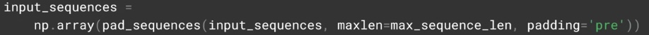

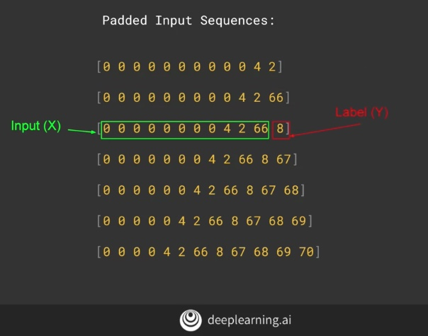

Create a one-hot encoding of the labels

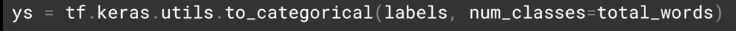

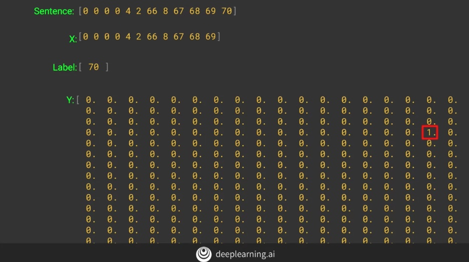

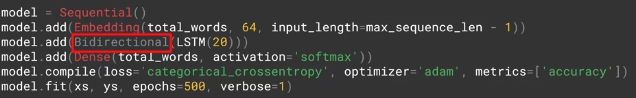

Predict

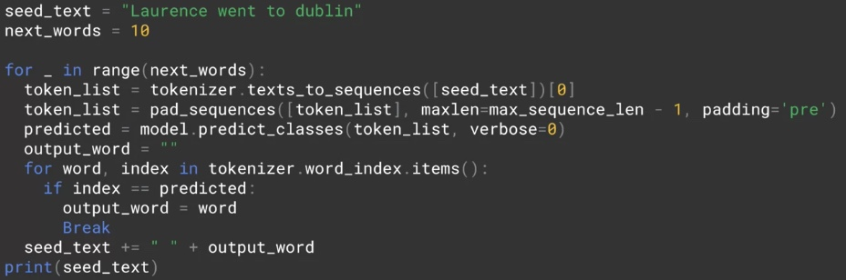

Poetry
------

Please find the link to Laurences generated poetry [here](https://storage.googleapis.com/laurencemoroney-blog.appspot.com/irish-lyrics-eof.txt).

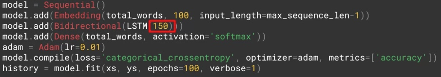

Reading
-------

Find the link to generating text using a character-based RNN [here](https://www.tensorflow.org/tutorials/sequences/text_generation).

Exercise 4 Answer- Using LSTMs, see if you can write Shakespeare!
-----------------------------------------------------------------

[https://colab.research.google.com/github/lmoroney/dlaicourse/blob/master/TensorFlow%20In%20Practice/Course%203%20-%20NLP/NLP\_Week4\_Exercise\_Shakespeare\_Answer.ipynb](https://colab.research.google.com/github/lmoroney/dlaicourse/blob/master/TensorFlow%20In%20Practice/Course%203%20-%20NLP/NLP_Week4_Exercise_Shakespeare_Answer.ipynb)

