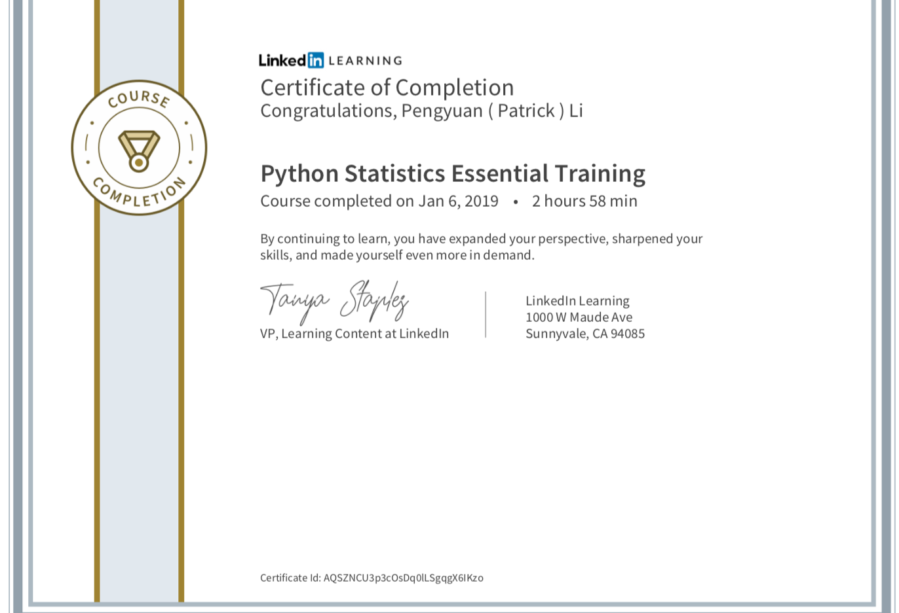

# Python-Statistics-Essential-Training
* Python Statistics Essential Training 
* Instructed by: **Michele Vallisneri** Director's Fellow at JPL (NASA's Jet Propulsion Laboratory)

---

### Data cleaning 
* File: billboard.csv 
* Import files, decode, data visualization, data processing
### Personal Email analytics
* File: input: tb.csv , output: finaltb.csv
* Pandas Melt, str.slice, 
* Slice sex from sexage with 'str.slice' and conver age to a more readable format with 'map'
## 3. Visualizing and Describing Data
###  03 02 Interative Data visualization
* File: gapminder.csv
* Mayplotlib, scatterplot, Jupyter's notebook's ipwidge, interactive method
* To practice my visualization skills in Python, I draw an interactive scatter plot of natality and mortality (age ≤ 5) of the whole world from 1950-2015.
* Though it is a common sense that the infant mortality rate has been dramatically reduced and birth rates are lower and lower all over the world, it's still shocked me when scattered them myself.
* Data comes from https://www.gapminder.org/data/
### 03 03 histograms
* File: china1965 = pd.read_csv('income-1965-china.csv')
china2015 = pd.read_csv('income-2015-china.csv')
usa1965 = pd.read_csv('income-1965-usa.csv')
usa2015 = pd.read_csv('income-2015-usa.csv')
gapminder.csv
* Boxplot
* Boxplot of logritham data
* Histogram
* Histogram with descriptive line
* Histogram with density (bw_method = 0.5)
* Comparable histogram with weights

### 03 04 plotting two variables
* File : gapminder.csv
* pandas.plot.scatter()
* pandas.plot.line() to drwa lines
* use numpy.where to mark decades by changing the size of the dots and set colors to different variables

### 03 05 more variables
* File: gappminder.csv
* if use colormap, the c must be array like, use numpy.array() to change a pandas.series to array.
* interact(plotyear,year=range(1965,2016,10)).
* pandas.plotting.matrix() to plot multipul variables
* take log value of gdp_per_day to show clear trends.
### 03 06 categorical
#### Describe categorical value
* Use DataFrame value_counts pd.DataFrame(smoking.smoker.value_counts()).
* Remove one index level using unstack().
* Devide cases into groups using pandas cut.
* value_counts(normalization = True) to get .
* if use colormap, the c must be array like, use numpy.array() to change a pandas.series to array
* interact(plotyear,year=range(1965,2016,10))
* pandas.plotting.matrix() to plot multipul variables
* take log value of gdp_per_day to show clear trends
### 03 06 categorical
#### Describe categorical value
* Use DataFrame value_counts pd.DataFrame(smoking.smoker.value_counts())
* Remove one index level using unstack()
* Devide cases into groups using pandas cut
* value_counts(normalization = True) to get 
* Simpson's paradox
### 03 07 categorical
#### plotting categorical value
* for categorical value, use value.counts() before plotting them.
* pandas.plot(kind = 'bar').
* pandas.plot(kind = 'barh') h for horizontal.
* pandas.plot(kind = 'pie') pie chart based on proportions.
* plot(kind='  ',stacked=True) put two columns values in one bar.
### 03 08 Personal Email Analytics
* convert and write csv file from .mbox.
* regulation expression  using model re .
* %debug to correct and apply() a function
* pandas.categorical & pandas datetime to manipulate date time.
* pandas.plot(kind = 'bar')
* pandas.plot(kind = 'barh') h for horizontal
* pandas.plot(kind = 'pie') pie chart based on proportions
* plot(kind='  ',stacked=True) put two columns values in one bar

### 03 09 plot distribution by hours for each day
* plot distribution by hours separately for each day.
* 1: using for loop
* 2: pandas groupby function
## 4. Introduction to Statistical Inference
### 04 02 Confidence Intervals
* use value_clunts(normalization = True) to obtain the real fraction.
* build a simple function to simulate such a sample, the function would take the actual fraction of votes for mayor brown and the number of people polled.
* repeat the simulation many times and collect the results in the DataFrame.
* function to simulate the sampling distribution for any true fraction.
* looked for a True fraction for which a measured value of .51  and the True fraction for which our measured value lies at a 2.5 quantile and 97.5 quantile.
* plot the histgrom of the simulation results use .hist(histtype = 'step').
### 04 03 Bootstrapping
* File : grades.csv 
* Went through bootstrap procedures.
* Generate a bootstrap sample, take the mean, repeat this for 1000 times using a Python list comprehension. Then fold this into a dataframe, call the variable 'meangrade'.
* using scipy to handle the play with distributions.
* functions to truncate the distribution
* simulated 
* compare different distributions to justify the estimated variance.
### 04 04 Hypothesis testing
* Made simulation use area 0 1 4 5 which have the most cases of cholera and simulate each death randomly,proportionally to the population of each area.
* Observe statistic in data
* Compute sampling distribution of statistic under null hypothesis
* Quantile of observed statistic gives P value.
### 04 05 P values an confidence
* make null hypothesis besed on the value_counts of the votes for Brown and Green.
* simulation based on the null hypothesis.
* computed P values to determin whether to reject the null hypothesis. 
* went through the process with a larger data set.
* 0405 original is what the instructor taught in class.
* 0405 myversion is modified by myself based on my understand of the definition of the Null Hypothesis.
### 04 07 Bootstrapping grades
* Used stats.percentileofscore(pop.grade,5). 
* Built a bootstrap distribution for this passing fraction by sampling with replacement and repeating 1,000 times.
## 5.Introduction to Statistical Modeling
### 05 02 Fit model
* Fitted smf.ols into gapminder.csv file with different model terms, quantitive variables and interaction terms.
### 05 03 Fit Goodness
* F statistics,  R^2, mean suqare error , AVOVA
### 05 04 Cross Validation
### 05 05 Logistic Regression
* Logistic Regression use statsmodels package
### 05 06 Bayesian

---

